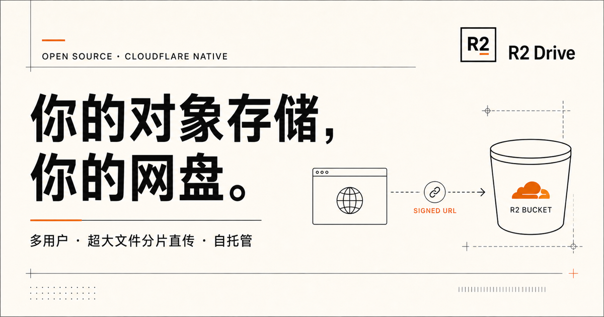

# R2 Drive

一个给自己使用的开源 Cloudflare R2 网盘。默认只有第一个主人账号能登录，其他人只能通过主人创建的分享链接下载。文件可由浏览器分片直传 R2，Worker 负责身份、授权和签名，D1 保存目录、分享与审计元数据。



## 已实现

- 私人主人账号：首个账号自动成为管理员，默认随即关闭注册
- 文件与文件夹：列表/网格、全盘搜索、分类、最近、排序、重命名、移动、固定快捷访问、范围下载
- 回收站：文件夹树软删除、恢复、单项永久删除与清空回收站
- 超大文件：R2 Multipart Upload，自适应分片，最多 10,000 片
- 两种上传路径：R2 S3 预签名直传；未配置凭据时自动使用 Worker 代理
- 容量保护：主人容量提示、上传前预留校验，可在高级设置中调整
- 分享：绑定自己的公网域名后开启；支持随机令牌、1/7/30 天或长期有效、下载次数上限、分享管理、撤销与公开流式下载
- 普通设置：资料、密码、主题、密度、默认视图、上传并发
- 开发者设置：可过期 API 令牌、细粒度 scope、只显示一次的密钥
- 管理设置：系统策略、运行时检查、审计事件；原有多用户能力保留为高级选项
- 一键更新：管理页检查 GitHub 正式版，本机助手自动备份、校验、迁移并重新发布
- 普通用户网络优化：R2 Local Uploads、APAC 新桶、自动代理回退、弱网分片与边缘缓存
- 默认安全：HttpOnly 会话、同源写校验、PBKDF2、哈希令牌、安全响应头、最小权限建议

## 为什么能传大文件

Cloudflare Workers 的入站请求体上限随套餐为 100 MB、200 MB 或默认 500 MB，不能把数 TiB 的文件整体穿过 Worker。R2 Drive 的控制面只创建上传任务并签发短期分片 URL，数据面由浏览器直接把分片发给 R2：

```text
浏览器 ── 申请上传/校验配额 ──> Worker + D1
浏览器 <──── 单分片短期 URL ─── Worker
浏览器 ═══════ 文件分片 ══════> R2 S3 API
浏览器 ─── ETag 清单/完成任务 ─> Worker + R2
```

R2 当前单对象上限为 5 GiB 少于 5 TiB，即约 4.995 TiB；Multipart Upload 最多 10,000 片。项目会在这两个边界内自动增大分片。参见 [R2 官方限制](https://developers.cloudflare.com/r2/platform/limits/) 与 [Workers 官方限制](https://developers.cloudflare.com/workers/platform/limits/)。

## 双击启动（小白推荐）

从 [GitHub Releases](https://github.com/oleyyu/R2-Drive-New/releases) 下载最新版 Source code 并完整解压后，不需要先打开终端：

- macOS：双击 `R2-Drive.command`。若系统首次拦截，右键文件选择“打开”。
- Windows：双击 `R2-Drive.bat`。

启动器会先显示一个固定菜单：

1. **打开网盘【已配置完毕／尚未配置】**：已绑定域名时直接打开域名版；没有域名时启动本机版。
2. **配置／重新配置**：首次使用或需要换桶、数据库、域名时打开中文安装助手。
3. **删除所有信息**：列出并永久删除当前实例的 R2 文件与桶、D1、Worker、域名绑定和本地配置。
4. **检查更新／一键升级**：打开本机更新页；检查不会改文件，安装前还会要求确认。

首次使用选择第 2 项，网页只要求完成三个操作：

1. 连接自己的 Cloudflare。
2. 点击“准备我的网盘”。
3. 有域名就先发布域名，再打开域名网盘创建主人账号；没有域名才打开本机版。

最后一步会显示“启动服务、编译页面、检查账号页、打开网盘”四段真实进度。若旧的 R2 Drive 仍占用端口，点击“重新启动网盘”会自动关闭能确认属于当前项目的旧进程，再启动新网盘；助手不会强制关闭无法确认身份的其他软件。

以后双击启动器选择第 1 项即可进入；不需要再看或输入 localhost 地址。如果电脑没有 Node.js 22.13 或更新版本，启动器会打开 Node.js 官方下载页面并说明下一步。使用期间保留终端窗口，关闭该窗口即可停止本地网盘。

第 3 项只处理当前 `wrangler.jsonc` 明确指向的实例，执行前会显示桶、数据库、Worker 和域名，并要求手动输入 `DELETE`。R2 中的文件不可恢复；任一步失败时会保留本地目标信息以便重试，不会退出 Wrangler 登录，也不会删除账号中的其他 Cloudflare 项目。

## 升级现有网盘

升级只替换程序并应用新增的 D1 迁移，不会清空原来的 R2 文件、主人账号、目录、分享或域名绑定。不要选择启动器中的“删除所有信息”。

推荐在域名网盘的管理页找到“程序更新”，点击“一键检查更新”。发现新版后点击“在本机安装更新”；若本机助手尚未运行，先双击启动器选择第 1 项，再点一次。也可以直接双击启动器选择第 4 项。

本机助手只从本仓库的 GitHub Releases 下载正式版，并会：

1. 校验仓库、版本、包身份、必要文件和安全路径。
2. 备份当前程序与 `wrangler.jsonc`，保留 `.dev.vars` 和本机 CORS。
3. 安装依赖并执行类型检查、lint、构建和测试。
4. 应用远程 D1 迁移；已绑定域名时自动重新发布 Worker。
5. 本地检查失败时自动恢复更新前的程序和配置。

手动升级仍然可用：先备份旧项目文件夹，下载并解压新版，把旧版的 `wrangler.jsonc`、`.dev.vars`（如有）和 `config/r2-cors.local.json`（如有）复制到新版相同位置，然后执行：

```bash
npm install
npm run check
npx wrangler d1 migrations apply r2-drive-db --remote --config wrangler.jsonc
npm run deploy
```

如果使用的 D1 名称不是 `r2-drive-db`，请把命令中的名称替换为 `wrangler.jsonc` 里的 `database_name`。生产 Worker Secret 保存在 Cloudflare，不会因为正常重新部署而消失；只有新版明确增加 Secret 时才需要补充。

## 本地安装向导

### 1. 前置条件

- Node.js 22.13 或更新版本
- 一个 Cloudflare 账号

```bash
git clone https://github.com/oleyyu/R2-Drive-New.git
cd R2-Drive-New
npm install
npm run setup
```

浏览器会自动打开安装助手。它只监听本机回环地址，并按顺序帮助每个项目使用者：

- 通过 Cloudflare 官方 OAuth 登录自己的 Wrangler
- 必须选择自己是否已有 Cloudflare 账号和 R2 存储桶；没有桶时可在页面一键创建私人 APAC R2 桶
- 自动检查或创建当前账号的 R2；D1 同名时自动复用、没有时创建，并把真实资源信息写入自己的 `wrangler.jsonc`
- 自动选择私人账号、Local Uploads、严格 CORS、弱网回退和分享边缘缓存
- 应用 D1 迁移
- 直接从安装助手启动本地网盘
- 可选地把桶级 R2 Token 保存到被 Git 忽略的 `.dev.vars`
- 自动读取所选 Cloudflare 账号中的 Active 域名；只有点击“一键发布并自动绑定”后才部署

首次打开会自动判断账号状态：没有主人时进入“创建主人账号”，已经创建过则进入登录。登录邮箱和至少 12 位的密码都由使用者自己设置，邮箱只作为登录名，不会发送验证码；页面要求再输入一次密码以防输错。数据库中的第一个账号会成为管理员；即使实例已经设置为关闭注册，第一个主人仍可创建，之后其他注册会被拒绝。密码只以 PBKDF2-SHA256 派生结果保存，不会把明文交给安装助手或项目作者。

向导不会把账号凭据发给项目作者，也不会复用任何预设项目 ID。域名识别只使用本机 Wrangler 登录授权向 Cloudflare 官方 API 读取 Zone 名称，Token 不会显示在页面或写入日志。你可以完全跳过发布，只在本机使用；此时公开分享会关闭，上传、整理和主人下载不受影响。管理页面提供“绑定域名”按钮，启动器会在本机准备域名配置助手。发布功能强制使用已接入当前 Cloudflare 账号的自有域名，并关闭 `workers.dev`。完整流程、命令白名单与手动安装方法见 [本地安装手册](docs/local-setup.md)。

## 普通账号可用的中国访问优化

下列能力可由普通 Cloudflare 账号直接启用：

- 新桶指定 `apac` location hint
- 免费开启 R2 Local Uploads：分片先写入靠近上传者的位置，再异步复制到桶
- `UPLOAD_MODE=auto`：直传失败后自动回退 Worker 代理
- 弱网 / 均衡 / 高吞吐三种分片大小，1–8 并发，指数退避重试
- `DOWNLOAD_MODE=proxy`：私有下载始终走你的应用域名
- 公开分享按需进入 Cloudflare 边缘缓存
- 自有域名使用 Cloudflare HTTPS，并可开启所有套餐可用的 HTTP/3
- Worker Smart Placement 自动靠近主要上游

这些手段不能凭空提供中国内地节点，也不保证每个地区和运营商同速，但都不需要企业合同，且已经接入代码或部署流程。详细开关和实测方法见 [docs/personal-acceleration.md](docs/personal-acceleration.md)。

## 文档

- [配置手册](docs/configuration.md)
- [本地安装手册](docs/local-setup.md)
- [普通用户网络优化](docs/personal-acceleration.md)
- [架构与数据模型](docs/architecture.md)
- [安全与运维](docs/security.md)
- [开发者 API](docs/api.md)

## 开发命令

```bash
npm run dev          # 本地开发
npm run types        # 生成 Cloudflare binding 类型
npm run db:generate  # 生成 Drizzle 迁移
npm run lint         # ESLint
npm run build        # vinext 生产构建
npm test             # 构建并执行产物/路由冒烟测试
npm run check        # 类型 + lint + 构建 + 测试
```

## 当前边界

- 文件分片失败后会自动中止服务端任务；跨浏览器会话的断点续传 UI 尚未实现。
- “移入回收站”只软删除元数据，仍占配额；永久删除或清空回收站才移除 R2 对象，生产环境仍建议增加独立备份/复制策略。
- D1 是业务元数据源，R2 是文件内容源；必须同时备份。
- 分享链接等同 bearer secret，请勿公开传播私密文件链接。

## 许可证

[MIT](LICENSE)
